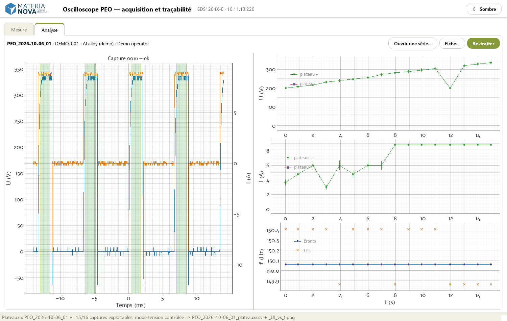

# PEO-showcase — open acquisition, traceability and analysis for a plasma electrolytic oxidation bench

**PEOscillo** turns a standard lab oscilloscope into the recording and analysis station of a
**plasma electrolytic oxidation (PEO)** bench. It drives the instrument, records each run as a
time-lapse series with its experimental record, verifies data integrity, and extracts the
physical quantities of every pulse train **live, while the experiment runs**: plateau voltage
and current, frequency, duty cycle, control mode (current- or voltage-controlled) and anomalies.

It is developed at **Materia Nova** (surface treatment & coatings R&D) as one building block of
a broader effort to retrofit existing laboratory equipment with open, vendor-neutral software,
so that experiments can be executed, recorded, analysed and archived in a single, reproducible
loop — and, ultimately, planned and steered by AI with a human in the loop.

> **Horizon Europe context** — this repository is part of Materia Nova's showcase for
> *HORIZON-RAISE-2027-01-01 — Automated Scientific Discovery (RAISE pilot)*.
> See **[docs/RAISE_alignment.md](docs/RAISE_alignment.md)** for how it maps onto the call
> and **[docs/ROADMAP.md](docs/ROADMAP.md)** for what comes next.



**→ [PEOscillo in pictures](docs/SHOWCASE.md)**: a guided tour of a complete (synthetic) PEO run,
from the experiment record to the control-mode estimate.

## What it does

| Step | Capability | Where |
|------|-----------|-------|
| **Drive** | Siglent SDS1204X-E over LAN (raw socket or VXI-11) or USB, pure-Python VISA (no vendor runtime). CLI and desktop GUI: channels, ranges, timebase, trigger, live view. | `scope/connection.py`, `scope/control.py`, `scope/cli.py`, `scope/gui.py` |
| **Record** | Time-lapse series (e.g. one capture every 30 s) under a dated, frozen experiment ID. Start **on threshold** (hardware trigger: nothing is recorded before the process actually starts), immediately or after a delay. | `scope/series.py` |
| **Document** | Experiment record (operator, sample, bath, set-point…) stored in the series' `meta.json`; missing fields are highlighted during the run, edits are logged; post-run results and attachments. | `scope/experiment.py`, `scope/gui_experiment.py` |
| **Trace** | SHA-256 checksums of every raw file, edit history, algorithm version (hash of the analysis code) and parameters recorded with each analysis; re-processing never modifies raw data and refuses tampered files. | `scope/experiment.py` |
| **Analyse** | Per capture: plateau segmentation (hysteresis, thresholds **relative to the measured noise**, so unit- and probe-independent), plateau statistics, frequency, duty cycle, uni/bipolar pulses. Per series: **control-mode estimate** (current vs voltage controlled) and anomalies (no signal, missing voltage channel, out-of-phase voltage, isolated voltage jumps, regime ruptures). | `scope/plateaux.py` |
| **Supervise** | Live analysis tab updated at every capture; one control sheet per run (every capture, detected plateaux highlighted, anomalies veiled in red) for a quick visual check. | `scope/gui.py`, `scope/plateaux.py` |
| **Re-process** | Any recorded series (including legacy ones) re-analysed with the current algorithm, outputs written apart from the raw data. | `scope/experiment.py::reprocess`, `tools/extract_plateaux.py` |

## Built for the lab floor

- **Retrofit, not replace** — a standard oscilloscope already present on the bench is the
  acquisition device; nothing in the PEO power supply is modified.
- **Fail-safe by design** — arming is impossible until the instrument answers; a lost link or
  an instrument error ends the series cleanly (captures and metadata kept); every error is
  time-stamped in `logs/oscilloscope.log`.
- **Zero-install station** — a self-contained Windows folder (embedded Python, double-click to
  start), built from Linux/NixOS; an idempotent `install.ps1` for source installs.

## Quick start

On a Windows machine (PowerShell), installs Git and Python 3.12 if needed, then the project:

```powershell
winget install -e --id Git.Git; winget install -e --id Python.Python.3.12; $env:Path = [Environment]::GetEnvironmentVariable('Path','Machine') + ';' + [Environment]::GetEnvironmentVariable('Path','User'); git clone https://github.com/bdv89/PEO-showcase.git "$HOME\PEO-showcase"; cd "$HOME\PEO-showcase"; powershell -ExecutionPolicy Bypass -File .\install.ps1
```

Then `.\.venv\Scripts\python.exe launcher.py` (GUI) or `python -m scope.cli --help` (CLI).
Details and troubleshooting: [INSTALL.md](INSTALL.md) (FR).

**Try it without an oscilloscope** — the synthetic demo run of
[`examples/demo-data/`](examples/demo-data/) (regenerated by `python examples/make_demo_data.py`):

```powershell
.\.venv\Scripts\python.exe tools\extract_plateaux.py examples\demo-data   # analysis -> examples\demo-data\resultats\
.\.venv\Scripts\python.exe tools\capture_showcase.py                      # full GUI run on a simulated scope
```

Re-processing records its trace (checksums, analysis) in the series' `meta.json`, exactly as on
a real run; `python examples/make_demo_data.py` restores the pristine demo series.

**Stack**: Python 3.12, PyVISA / pyvisa-py, NumPy, pandas, SciPy, PyQt5 / pyqtgraph, matplotlib.
Windows and NixOS (flake / shell.nix).

## Repository layout

```
scope/          Instrument driver, series recorder, experiment record & traceability, plateau analysis, GUI
tools/          extract_plateaux.py (offline re-analysis), capture_showcase.py (screenshots), licence inventory
tests/          pytest suite (instrument and GUI simulated; no hardware needed)
examples/       Synthetic demo PEO run and its generator
packaging/      Reproducible build of the self-contained Windows folder
docs/           Showcase, RAISE alignment, roadmap; technical documentation (FR)
```

## Tests & quality

```powershell
.\.venv\Scripts\python.exe -m pytest      # whole suite, no hardware needed
```

The suite drives the real GUI off-screen against a simulated oscilloscope, checks the exact SCPI
sequences sent to the instrument, and pins the analysis results (flags, plateau values, control
modes) capture by capture.

## Documentation

- **[docs/SHOWCASE.md](docs/SHOWCASE.md)** — guided tour with screenshots
- **[docs/RAISE_alignment.md](docs/RAISE_alignment.md)** · **[docs/ROADMAP.md](docs/ROADMAP.md)** · **[TODO.md](TODO.md)** (known issues)
- **[INSTALL.md](INSTALL.md)** — installation and update (FR)
- **[docs/README.fr.md](docs/README.fr.md)** — full technical README (FR): connection notes and
  pitfalls verified on the hardware
- **[docs/architecture.md](docs/architecture.md)**, **[docs/usage.md](docs/usage.md)**,
  **[docs/scpi-reference.md](docs/scpi-reference.md)** — architecture, usage, SCPI reference (FR)

## License

Copyright 2026 the PEOscillo contributors. Licensed under the **[Apache License 2.0](LICENSE)** —
see [NOTICE](NOTICE): the Materia Nova name, logo and visual identity are **not** covered by the
licence. Third-party dependencies keep their own licenses: see
[THIRD_PARTY_LICENSES](THIRD_PARTY_LICENSES), regenerated by `tools/gen_third_party_licenses.py`.

## Contact

Materia Nova — <https://www.materianova.be>
