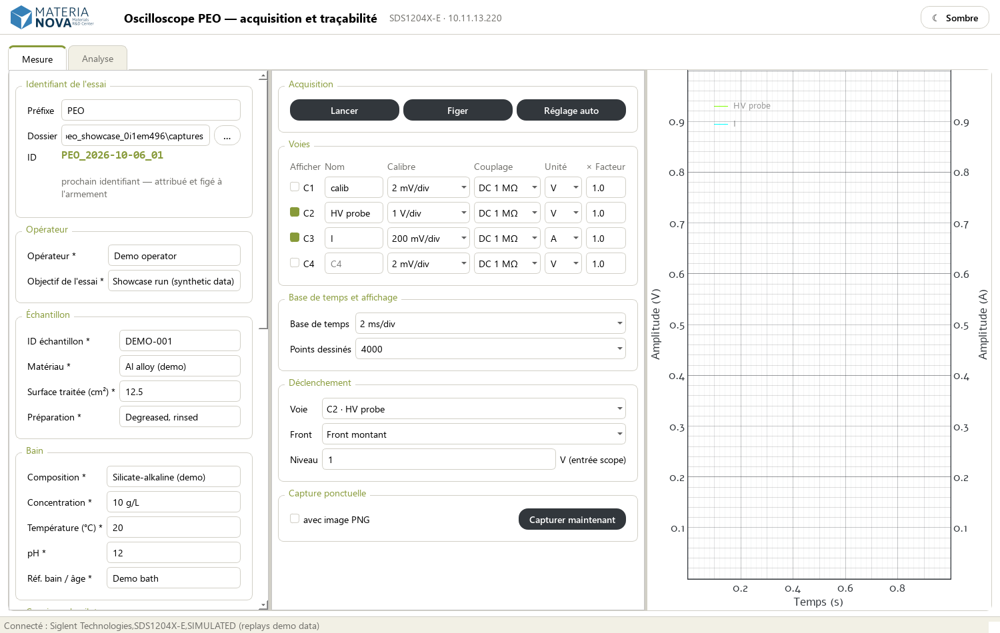
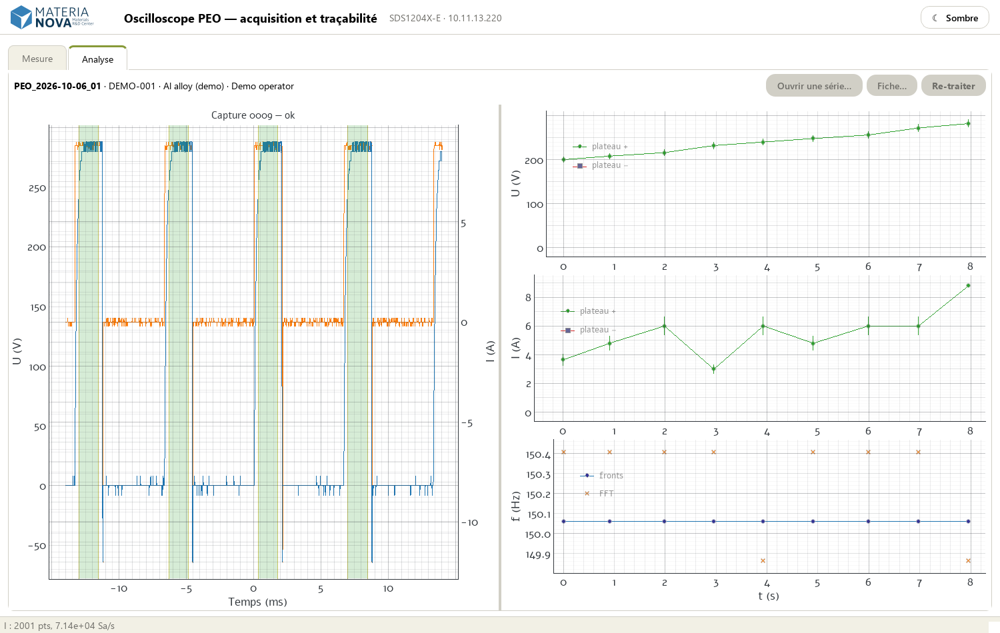
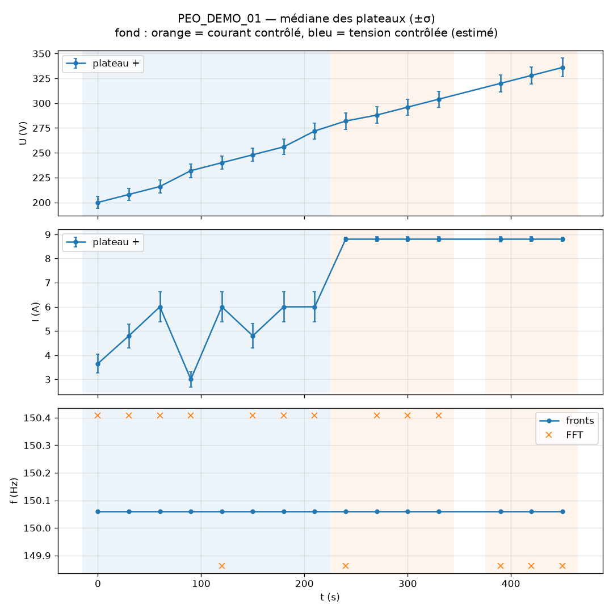
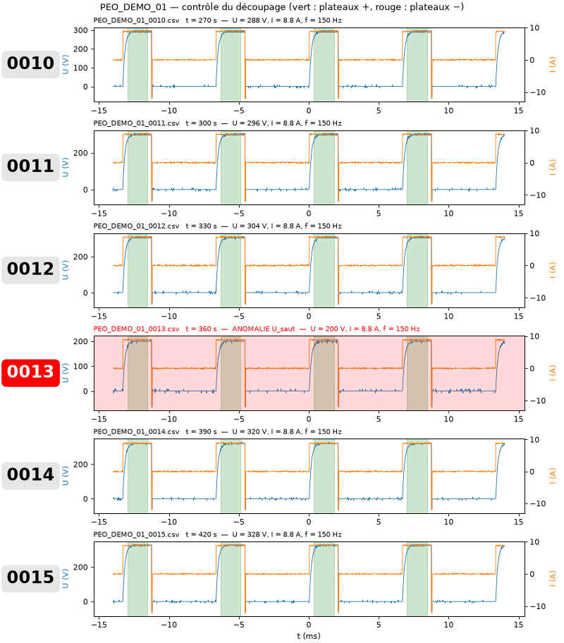
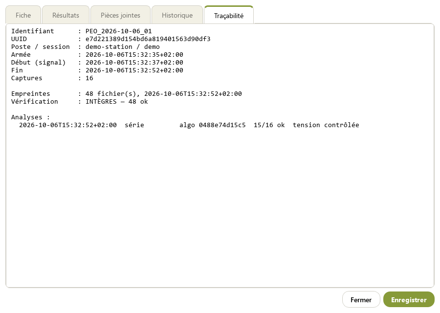

# PEOscillo in pictures

A guided tour of one **plasma electrolytic oxidation (PEO)** run, recorded and analysed by
PEOscillo. The run is **synthetic**: the 16 captures of
[`examples/demo-data/PEO_DEMO_01`](../examples/demo-data/) are generated by
[`examples/make_demo_data.py`](../examples/make_demo_data.py), not measured. They mimic a
typical run: unipolar pulses at 150 Hz, a voltage-controlled ramp, then the current limit is
reached and the voltage keeps rising as the oxide grows; one capture carries an isolated voltage
dip. The screenshots are regenerated by [`tools/capture_showcase.py`](../tools/capture_showcase.py),
which runs the **real application** against a simulated oscilloscope replaying these captures.
The user interface is in French.

## Why an open recording station on a PEO bench

PEO coatings grow under thousands of micro-discharges per second; the electrical signature of
the process (plateau voltage and current of each pulse, their evolution over minutes, the moment
the supply switches from voltage to current limitation) is the main window on what happens at
the surface. On many benches this signature is watched on an oscilloscope screen and lost, or
saved as anonymous screenshots. PEOscillo turns the same instrument into a traceable recorder:

| Benefit | How |
|---|---|
| **Nothing lost, nothing anonymous** | Every capture is a raw CSV stored with the run's experiment record, timestamps and instrument settings in one `meta.json`. |
| **Same numbers for everyone** | One documented algorithm extracts plateau voltage, current, frequency and duty cycle; its version and parameters are recorded with every analysis. |
| **Trust in the data** | SHA-256 checksums of every raw file; re-processing refuses modified files and never writes into the raw data. |
| **See the process while it runs** | The analysis tab updates at every capture, so a drift or a failed start is visible during the run, not afterwards. |
| **Robust on the lab floor** | Arming is blocked until the instrument answers; a lost link ends the run cleanly; every error is time-stamped in a log file. |

## A run, step by step

### 1. Prepare: experiment record and instrument settings

Left: the **experiment record** (operator, sample, bath, set-point, planned duration). Required
fields left empty are highlighted in red while the run is armed or recording. The dated
experiment ID is proposed, then frozen at arming. Below the record, the recording settings: one
capture every 30 s, start **on threshold**, and the channels analysed as voltage (C2) and
current (C3). Centre: the oscilloscope settings, shown with readable labels (`1 V/div`,
`DC 1 MΩ`, `Front montant`) while the SCPI codes stay internal. Right: live view.

### 2. Record: start on the process itself, analyse every capture

**Arming** sets the oscilloscope trigger on the voltage channel: nothing is recorded before the
supply actually starts, so the run-in is discarded by the instrument itself. From that moment
the oscilloscope acquires continuously and one capture is taken at each tick. Every capture is
analysed immediately. Left, the capture with its detected **plateaux** (green). Right, one new
point per capture for the plateau voltage, current (median ± σ) and pulse frequency (edges and
FFT).

### 3. End of run: synthesis and control mode

At the end of the series the run is summarised: usable captures, isolated anomalies, and the
**control mode** of every capture. The status bar reports `15/16 captures exploitables`. The
16th is the isolated voltage dip, which is flagged and excluded from the synthesis.

The estimated control mode is drawn as the background: blue for **voltage-controlled** (current
erratic, voltage following its ramp), orange for **current-controlled** (current at its 8.8 A
limit, voltage rising as the layer grows). The transition is located without lag, and the dip
capture (white gap near t = 360 s) does not perturb its neighbours. The estimator compares, over
neighbouring captures, how far each quantity departs from a straight line (roughness) and how
much it drifts. The controlled quantity is the one that follows its set-point.

### 4. Check every capture at a glance

One image per run lists **every capture**, each row with its large capture number (identical to
the CSV file suffix), the file name, the detected plateaux and the extracted values. A capture
with an anomaly is veiled in red with its flag written out (`no_signal`, `U_absent`,
`U_dephase`, `U_saut`…). Scrolling this sheet is enough to validate the segmentation of a whole
run. The excerpt above shows captures 10 to 15 of the demo run: #13, the isolated voltage dip
(200 V instead of ~310 V at an unchanged current), is flagged `U_saut`.

### 5. Traceability: who, when, with which algorithm

**Fiche…** reopens a recorded run: record, post-run results, attachments, the history of every
edit (who, when, before, after), and **traceability**. Traceability covers the run identifier
and UUID, the station, the arming / start / end times, the checksums and their verification,
and every analysis applied, with the algorithm version (hash of the analysis code) and its
parameters. **Re-traiter** replays the current algorithm on the raw files after verifying their
checksums, which also works for runs recorded before these features existed.

## What the analysis is robust to

| Situation | Behaviour |
|---|---|
| Current channel in mA instead of A, probe ×10 instead of ×100 | Plateau detection uses thresholds **relative to the measured noise** of each channel, so it gives the same result at any scale. This is tested at A, mA, µA and kA scales. |
| Micro-discharges chop the current | Segmentation switches to the voltage channel when it is more regular. |
| Bipolar pulses | Positive and negative plateaux are reported separately. |
| Turn-off spikes, edges | They are rejected, and the edges of each plateau are trimmed before statistics. |
| Isolated outlier capture | It is flagged `U_saut`, excluded from the synthesis and from the control-mode estimate. |
| Durable regime change at constant current | It is reported as a rupture, and the data are kept. |
| Instrument stops answering mid-run | The run ends cleanly, and the captures already taken and the metadata are preserved. |
